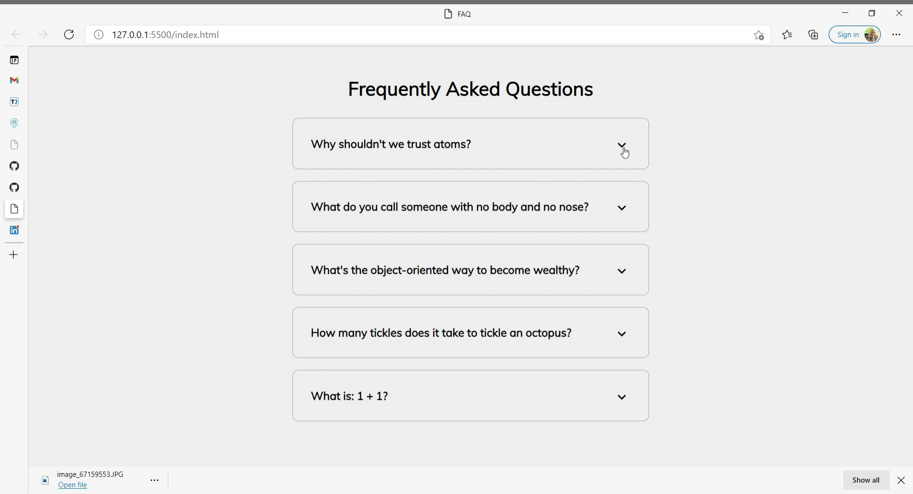

# FAQ Collapse

## Table of Contents

  - [Purpose](#purpose)
  - [Final Product](#final-product)
  - [Technologies](#technologies)
  - [Questions](#questions)
  - [Credits](#credits)

## Purpose

This is **Project 13** of Udemy's ["50 Projects in 50 Days for HTML, CSS and JavaScript"](https://www.udemy.com/course/50-projects-50-days/learn/lecture/23595208#overview) taught by Brad Traversy.

This project demonstrates a set of expanding cards with questions and answers, like a common FAQ section of a webpage.

## Final Product

)

## Technologies

- HTML
- CSS
- JavaScript

## Questions

If you have any questions about this project, contact Christina at christinamausley@gmail.com.

## Credits

Christina would like to thank Udemy and Brad Traversy for assistance alongside the ["50 Projects in 50 Days for HTML, CSS and JavaScript"](https://www.udemy.com/course/50-projects-50-days/learn/lecture/23595208#overview) course.